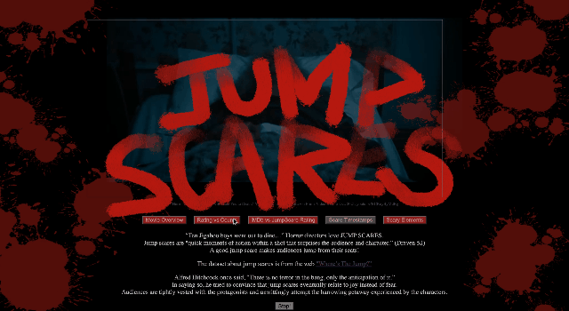

## Data Story :smiling_imp:

## The Project: Jump Scares!
 - Link to the live version of the project: See my work [here](https://liuliulexie.github.io/cdv-student/projects/datastory-structure/index.html)
 - An animated GIF:

 - About the project: In the world, there is a group of jump scare fans collecting data about jump scares! They collect them, list them and display them. My project does some further visualization on the data about jump scares, after viewing my graphs, it might be possible to see through some of the horror movie director's tricks and then enjoy the joy jump scares bring to us.

 - links to the source of the data you used: [Where's the Jump? Full Movie List](https://wheresthejump.com/full-movie-list/) and I use python to do the further scraping which goes into each movie link to get their tags, runtime and scare timestamps. (special thanks to Leon's cool scraping workshop)

## The Process

- Why did you choose to visualize the data in this way?
- In my initial design, I chose a force graph for the first movie overview graph but when the visualization came out, the later movies released from 2000 to 2020 just stack together and the graph does not show any clear information. Thus, I redigned my graphs. 1st graph: show general information of the jump scare movies, give viewer an overview of the movies; 2nd graph: a force graph show that the jump scare rating, to some extent, really relate to the jump scare number in each movie (this is what I didn't expect); 3rd graph: explore whether there’s any connection between IMDb ratings of the movies and their jump scare ratings, it seems that  not every one likes jump scares; 4th graph:failed, planned to show the scare timestamps by a line chart; 5th graph: show what scary elements the horror directors prefer to use in their jump scare movies and leave a tiny question that viewers can answer what elements their are scare of (maybe I can really collect the data one day). Moreover, 3 mins there's a surprise in the website! I design this, want to visualize how a jump scare works in a horror movie, jumping out when people are not expecting it and scaring them.

- Did you make crucial compromises? Which ones?
- Biggest, I abandon the fourth graph :cry:

- If you had more time, what would you change, improve, add to the project?
- Further development: 1. I would debug the none-response of mouseover and mouseout which make my detail information disappear; 2. When coding and testing, I have the bgm muted. Then when I unmuted after done the visualization, I found it can't be played continuously in different html pages; however, I don't have time to improve that. If I have more time, I would reorganize all my visualization graphs into one html page and use sections instead of buttons to label and link to them; 3. I would rearrage the scare timestamps data and try my best to do the line chart; 4. really collect the data in 5th graph that what do people scare of.

> See my work [here](https://liuliulexie.github.io/cdv-student/projects/datastory-structure/index.html). 