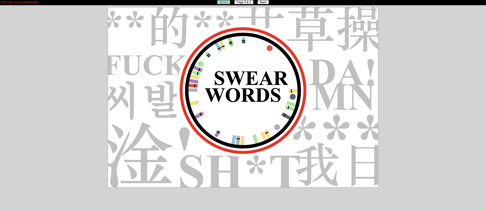
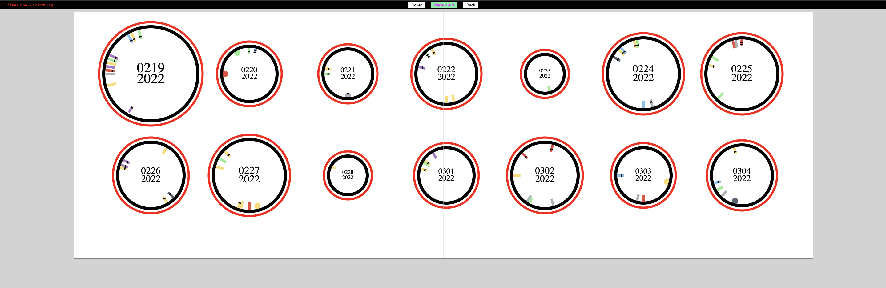
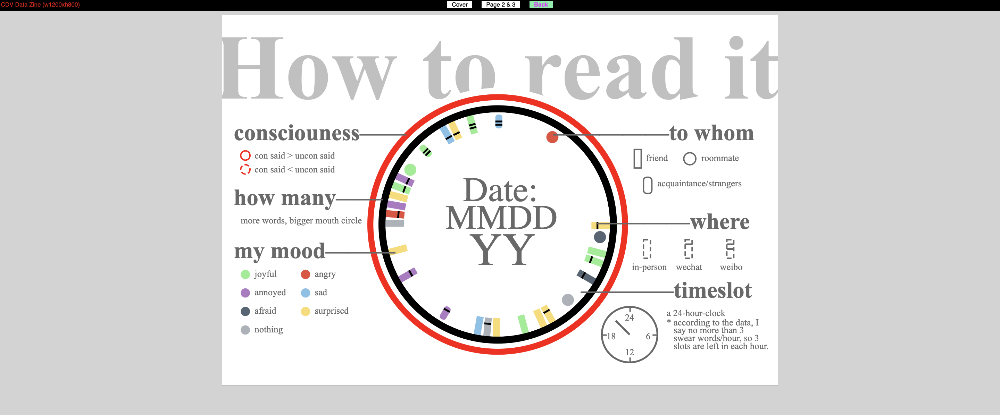

## Data Zine 📖

Here is the screenshots of every page of my data zine.

### cover

### middle page

### back

# What and Why?
- I chose to collect the data of swear words I say in two weeks. I initial reason of choosing this is my personal habbit. I'm a person who was not prohibited from swearing by my family members which is rare in China. Chinese traditional culture shows high respect to manners and politeness, leading to stereotypes towards swear words. Most people view them negative words and think they only express bad emotion such as anger, disgust, etc. However, today, swear words are used to express more moods. They tend to become popular in literature works and daliy communication. Some are even inclueded in dictionaries. I find this tendency interesting, thus, decide to do this data collection myself.

# How?
- In terms of the data collection, I created a google form with several questions that ask about the date, time, what I said (this was later deleted), to whom I said the word, whether I was conscious, what emotion/mood the word includes.
- In terms of the visual design, first, I wanted to make every day data group a whole mouth and let the single data points show like teeth in the mouth. I simplized the open mouse to a circle with a bigger red circle which can be viewed as lips (which later display the consciousness feature). Later, because of how I collected the data, I came up with the idea of thinking of the circle as a clock and position the datapoint in timeslots. 
- Here comes the coding process. I have encountered many challanges during the coding. The biggest challenge I encountered is how to handling the data into the visulization I convienced. Thanks to Leon, Leon helped me to do the handling with linearscale functin and transforming the groups into arrays. Also, we created more layers of data，day, hour for later visulization. 

# Further Development
- There aren't many datapoints as I think, so the 24-hour-clock seems a little too much and could be adjusted for improvements. Some details of the visualization highlighted in my slides need to be fixed. And now the cover and back page use fake data to do the visualization, I'm not sure whether it is a proper way. Last but not least, the layout of the day data circles is boring, hope I can figur out the bubble chart. 
- Overall, I'm happy with what I have learned during the whole project process. 

> See my work [here](https://liuliulexie.github.io/cdv-student/projects/datazine/). 

> See my slides [here](https://docs.google.com/presentation/d/16LlfLAcphdqNlyzqCNoAKtuhqQWFX0rnibNsax0I9nA/edit#slide=id.g11a14102ab1_0_0). 